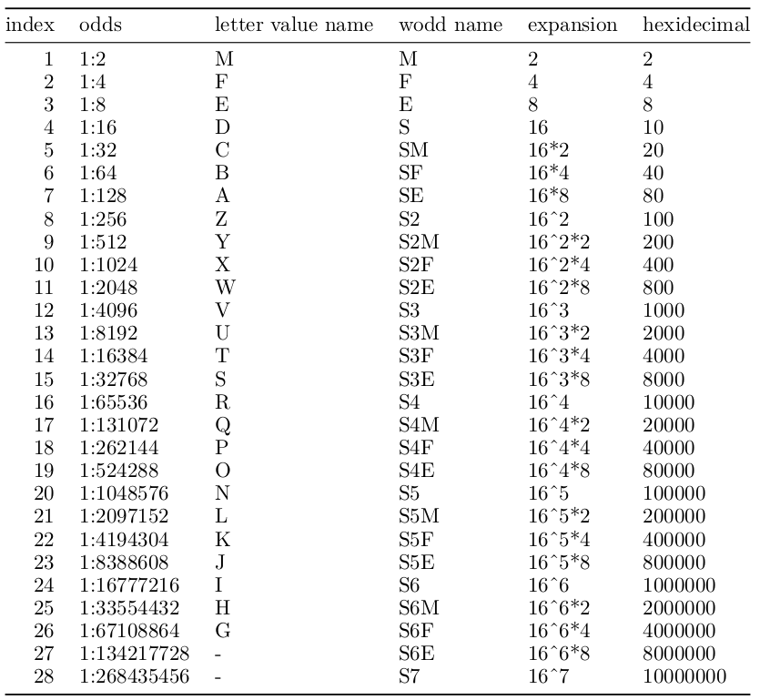

<!-- README.md is generated from README.Rmd. Please edit that file -->

```{r, include = FALSE}
knitr::opts_chunk$set(
  collapse = TRUE,
  comment = "#>",
  fig.path = "man/figures/README-",
  out.width = "100%"
)
```

<h1 align="center">Whisker Odds (wodds)</h1>
<p align="center">wodds calculation for big data</p>

<!-- badges: start -->
<!-- badges: end -->

The goal of `wodds` is to make the calculations of whisker odds (wodds) easy.
Wodds follow the same rules as letter-values, but with a different naming 
system.

## Installation

You can install the development version of `wodds` from [GitHub](https://github.com) with:

``` r
# install.packages("devtools")
devtools::install_github("alexhallam/wodds")
```

## Example

This is a basic example which shows you how to solve a common problem:

```{r example 1}
options(digits=1)
library(wodds)
library(knitr)
a <- rnorm(n = 1e4, 0, 1)
df_wodds <- wodds::wodds(a)
df_wodds
```

```{r example 1.1}
df_wodds_and_outs <- wodds::wodds(a, include_outliers = TRUE)
df_wodds_and_outs
```

A `knitr::kable` example for publication.

```{r example 2}
knitr::kable(df_wodds, align = 'c',digits = 3)
```

### Getting the depth

```{r example 3}
wodds::get_depth_from_n(n=503507L, alpha = 0.05)
```


### Getting the sample size

```{r example 4}
wodds::get_n_from_depth(d = 17L)
```

## Whisker Odds and Letter-Values

Letter-Values are a fantiastic tool! I think the naming could be improved. 
For this reason I introduce whisker odds (wodds) as an alternative naming system.
My hypothesis is that with an alternative naming system the use of these 
descriptive statistics will be see more use. This is a rebranding of a what I
think is a powerfull modern statistical tool.




